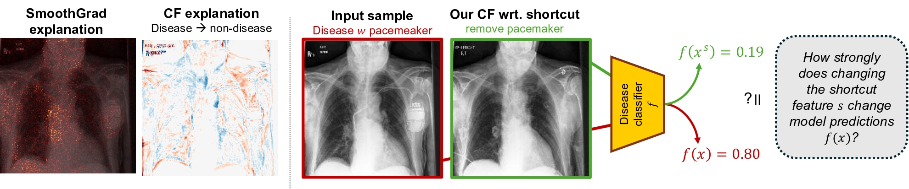

# FastDiME for Shortcut Removal and Generation (Med)



Public pytorch implementation for our paper [Fast Diffusion-Based Counterfactuals for Shortcut Removal and Generation](https://arxiv.org/abs/2312.14223). This code repository contains the medical part of the paper, including:
* generate counterfactuals wrt. shortcuts for three medical datasets
* evaluate shortcut learning
* provide shortcut annotations for the Che-PM and NIH-chest tube case.

If you find this code helpful in your research, please cite the following paper:

```
@article{weng2023fast,
    title={Fast Diffusion-Based Counterfactuals for Shortcut Removal and Generation},   
    author={Weng, Nina and Pegios, Paraskevas and Petersen, Eike and Feragen, Aasa and Bigdeli, Siavash},
    journal={arXiv preprint arXiv:2312.14223},
    year={2023}
}
```

------ *Update on July 19, 2024* ------

This work has been accepted at the 18th European Conference on Computer Vision (ECCV), 2024. 
Please check out our [project webpage](https://fastdime.compute.dtu.dk/).
-------------------------- --

## Virtual Environment Setup
The code is implemented in Python 3.9 using the Pytorch library. We only tested the code with Pytorch 3.9. One way of getting all the requirements is by using virtualenv and the requirements.txt file.

`pip install -r requirements.txt`

## Running the Code

### 0. Preparation
Before running the code, a number of parameters must be configured:
* Create `global_config.py` as following under this repo, and add your own path to it:

```
REPO_HOME_DIR =  # absolute path of this repo
DATASET_DIR = # absolute path of the dataset folder

CHE_DATASET_DIR = DATASET_DIR + 'path_to_chexpert'
NIH_DATASET_DIR = DATASET_DIR + 'path_to_nih'
ISIC_DATASET_DIR = DATASET_DIR + 'path_to_isic'
```

* Download the pre-trained diffusion and classifier model from [https://drive.google.com/file/d/1aEE39QoYiNTU8puuIeclLPOWgIOZ-86N/view?usp=drive_link](https://drive.google.com/file/d/1aEE39QoYiNTU8puuIeclLPOWgIOZ-86N/view?usp=drive_link) and put the unzipped folder under `./pretrained_models/`.  
* Prepare the datasets: the dataset should be put under `./datasets/` with the structure below:

```
├── DATASET_NAME
│   ├── train
│   │   ├── shortcuts
│   │   │   ├── xx.jpg
│   │   │   ├── ...
│   │   ├── non-shortcuts
│   │   │   ├── xx.jpg
│   │   │   ├── ...
│   ├── test
│   │   ├── shortcuts
│   │   │   ├── xx.jpg
│   │   │   ├── ...
│   │   ├── non-shortcuts
│   │   │   ├── xx.jpg
│   │   │   ├── ...
```

We provide our splits together with the shorcut annotations as `.csv` file under `./shortcut_annotations/`, and we provide scripts in `./prepare_data/make_dataset.py` to prepare the datasets based on the shortcut annotations and splits, where you can use `which_ds` variable to choose the dataset. 


### 1. To generate shortcut-free counterfactuals 

Run `generate_cf.py`. Note that the config setting could be adjusted in `./CFgenerating/config_cf.py`.
* There are 2 key parameters that could be played with in cf config: 
    * `model_var`: corresponding to the different variants in the paper, could choose from `['DiME','FastDiME','FastDiME-2','FastDiME-2+','FastDiME-woM']`.
    * `dataset`: 3 different medical datasets, could be chosen from `['chexpert', 'nih', 'isic']`. 
* There are other hyper parameters that could be modified based on different purposes, please check the other hyper parameters out in `./CFgenerating/config_cf.py`.

Generated counterfactual images will be saved under `./records/cf_generating/`, where `x_0.png` is the original image and `x_1_0.png` is the CF image. The label and target label can be found under `lab_target.txt`.


### 2. To evaluate shortcut learning

In order to evaluate the shorcut learning, we first follow the pipeline in figure 4 in our paper to prepare the unbalanced datasets and a balanced common test set.

* Run `./prepare_data/make_unbalanced_dataset.py` to:
    * prepare the unbalanced datasets $D_k, k = {100, 75, 50}$, where $k$ refers to $k$% of samples with target label $=1$ also have the shortcuts, i.e. in $D_100$ for CHE_PM dataset, all samples with Cardiomegaly have pacemakers, and all non-Cardiomegaly samples are without pacemaker. Choose the dataset to process with variable `which_ds`.
    * prepare a common balanced test set following the dataset structure in [0.Preparation](#0-preparation), which is the $test_u$ in the paper. 
    * you will get 4 datasets at the end under `./datasets`, namely `DATASET_100`, `DATASET_75`, `DATASET_50` and `DATASET_common_testset`.
* Generate the counterfactuals of the commen balanced test set $test_u$ by running `./generate_cf.py` while changing the `dataset` to `DATASET_common_testset` in `./CFgenerating/config_cf.py`.

Then, we evaluate:
> *How strongly does changing the shortcut feature change model predictions f(x)?*

by running `detect_shortcut_learning.py`, where 3 steps are included in the scripts:
* Train the classifiers based on the unbalanced datasets.
* Obtain the counterfactuals wrt. shortcut of the images in the common test set.
* Evaluate the results and save as `.csv` and `.txt` files under `./records/shortcuts/`. 

**Notice:** `Drain` labels in `./prepare_data/metadata_files/nih_drain_meta.csv` are not all annotated by humans, but binary predicted values, from a classifier trained on annotated data. The reason to do so, is because the annotations of chest drain by [Damgaard and Eriksen et al. 2023](https://arxiv.org/abs/2309.02244) and [Oakden-Rayner and Dunnmon et al. 2019](https://arxiv.org/abs/1909.12475) only contrains pneumothorax-positive cases. However, for this part of the experiment, we need both disease-positive and negative cases.

**Tips:** For the CF shortcut detection to work the best, it's better to disable the rescale during counterfactual generation, by changing `rescale_t=True` to `rescale_t=False`.

Other dependent functions:
### 3. To train the UNet-based Diffusion Model

Run `./train/train_diffusion.py`. Edit the configuration in `./train/config.py`. The trained model, together with inference samples per 5 epochs will be saved under `/records/diffusion/`.

## Code Structure

* `/CFgenerating` contains codes for generating counterfactuals.
* `/models/` gives the model classes used in this work.
* `/prepare_data/` gives scripts to prepare datasets.
* `/shortcut_detection/` contains codes for evaluating shortcut learning.
* `/shortcut_annotations/` contains shortcut annotations (see [Sec. Shortcut Annotations](#shortcut-annotations)).
* `/train/` contains codes for training diffusion models and classifiers.

## Data
The three datasets used in this work are all public and can be downloaded from:
* [CheXpert](https://stanfordaimi.azurewebsites.net/datasets/8cbd9ed4-2eb9-4565-affc-111cf4f7ebe2)
    * A resized smaller version on [kaggle](https://www.kaggle.com/datasets/ashery/chexpert)
* [NIH Chest X-ray](https://nihcc.app.box.com/v/ChestXray-NIHCC)
* [ISIC](https://challenge.isic-archive.com/data/)


## Shortcut Annotations
The annotations of chest drains from NIH are crow-sourced from both radiologists and non-experts ([Damgaard and Eriksen et al. 2023](https://arxiv.org/abs/2309.02244), [Oakden-Rayner and Dunnmon et al. 2019](https://arxiv.org/abs/1909.12475)), and pacemakers in CheXpert are labelled using [LabelMe](http://labelme.csail.mit.edu/Release3.0/) by Nina Weng. Ruler markers in ISIC were also annotated using [LabelMe](http://labelme.csail.mit.edu/Release3.0/) by Aasa Feragen.

As a part of the contribution, we public the shortcut annotations used in this work, which were annotated by us. 
- Pacemaker annotations (Chexpert dataset), check [che_pm_shortcut_labels.csv](./shortcut_annotations/che_pm_shortcut_labels.csv)
- Ruler marker, patches, ink annotations (Skin Lesion ISIC), check [isic_ruler_shortcut_labels.csv](./shortcut_annotations/isic_ruler_shortcut_labels.csv)

Please cite the abovementioned work if you use our annotations.


## Contact
Please use the issue tracking tool to report bugs or email directly to [ninwe@dtu.dk](ninwe@dtu.dk). If you have further questions regarding the paper, please feel free to email [ninwe@dtu.dk](ninwe@dtu.dk) as well.


